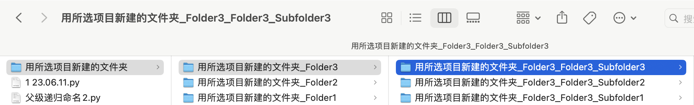

# Parent-Level Recursive Naming Script

[中文](README.md)|[English](README_ENGLISH.md)

#### Function

Parental recursive naming is a naming convention often used for naming files, folders, or variables, where longer names contain parts of shorter names. This way of naming allows us to organize and identify things more clearly, similar to family naming in genealogy.

#### Effect

~~~
- Family Photos
  - Family Photos_Holidays
    - Family Photos_Holidays_2022_Summer Holidays
    - Family Photos_Holidays_2023_Winter Holidays
  - Family Photos_Weddings
  - Family Photos_Birthdays
~~~

